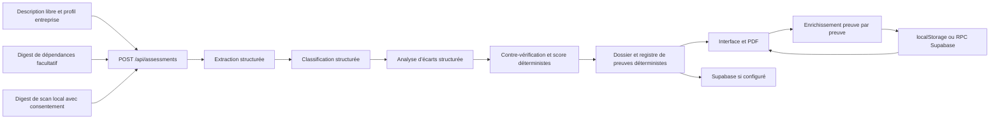

# Dossier instantané — architecture et contrat de confiance

## Statut du document

Ce document décrit la version effectivement implémentée de la vision « dossier instantané » de Preuvance au 20 juillet 2026. Il distingue volontairement ce que le produit calcule, ce que le modèle propose, ce que les sources techniques observent et ce qu’un humain atteste.

Le résultat est un **dossier vivant de maîtrise IA**, construit à partir d’une description libre et, facultativement, de deux observations locales expurgées : un digest de dépendances et un digest du scan du poste. Le dossier regroupe la préqualification, les écarts, le journal de décision, les preuves attendues et le registre modifiable « preuve par preuve ».

Ce dossier n’est ni un certificat de conformité, ni un audit juridique, ni une décision de couverture d’assurance. Il prépare une revue humaine et une discussion de pré-souscription.

## Promesse produit, avec ses frontières

La promesse opérationnelle est : **décrire, observer, étayer**.

1. L’utilisateur décrit son système et son entreprise en français.
2. Il peut joindre des observations techniques calculées dans son navigateur.
3. Le pipeline structure les faits, propose une préqualification et identifie les écarts dans des schémas stricts.
4. Des règles déterministes hydratent le droit daté, contre-vérifient les conclusions et calculent le score réglementaire.
5. Un constructeur déterministe crée une ligne distincte pour chaque preuve attendue.
6. L’utilisateur enrichit ensuite ce registre, ajoute des métadonnées de pièce et, s’il le souhaite, atteste une revue humaine.

Preuvance ne promeut jamais automatiquement une déclaration ou une détection en preuve attestée. Le statut le plus élevé exige un relecteur et une date de revue.

## Vue d’ensemble



## Responsabilités par couche

| Couche | Responsabilité | Autorité et limite |
|---|---|---|
| Formulaire | Recueillir organisation, système, description et profil d’entreprise | Déclaration utilisateur ; aucune vérification implicite |
| Scanner de dépendances | Reconnaître des packages IA dans trois familles de manifestes | Observation bornée ; ni analyse du code, ni preuve d’usage en production |
| Scan local | Mesurer une exposition du poste et la concordance déclaré/observé | Rapport brut local ; seul un digest agrégé peut être transmis avec consentement |
| Modèle — extraction | Transformer la description et les digests en faits structurés | Aucun rôle de qualification juridique à cette étape |
| Modèle — classification | Proposer une préqualification à partir du référentiel fourni | Sortie stricte, prudente, contre-vérifiée ensuite |
| Modèle — écarts | Proposer actions et preuves attendues | Ne change pas la classification et ne crée pas de citation libre |
| Moteur déterministe | Hydrater les obligations, contre-vérifier, scorer, assembler | Source d’autorité pour le score final et le contrat de rapport |
| Registre de preuves | Suivre l’état, la source, l’empreinte et la revue de chaque pièce | « Attesté » signifie revue déclarée dans Preuvance, pas certification externe |
| PDF | Rendre le payload déjà validé | Ne recalcule pas le score et n’invente aucune preuve |

## Flux détaillé

### 1. Entrée principale

`AssessmentForm` construit un objet validé par `AssessmentRequestSchema` :

- nom de l’organisation, de 2 à 160 caractères ;
- nom du système, de 2 à 160 caractères ;
- description libre, de 50 à 5 000 caractères ;
- effectif, chiffre d’affaires et total du bilan ;
- `dependencyDigest` facultatif ;
- `scanDigest` facultatif.

La route `POST /api/assessments` accepte uniquement du JSON et borne le corps à 96 000 octets. En production, Supabase doit être configuré et une session valide est exigée avant les appels OpenAI. Le quota est consommé atomiquement avant le premier appel modèle. En développement sans Supabase, le pipeline peut fonctionner mais annonce explicitement que la persistance est désactivée.

L’interface demande un flux NDJSON et n’affiche une progression que lors des événements réels `extraction`, `classification`, `gap_analysis` et `synthesis`. Aucune chaîne de pensée n’est transmise.

### 2. Contexte transmis au modèle

Le premier appel reçoit :

- le contexte déclaré ;
- la description encadrée comme donnée utilisateur ;
- les dépendances reconnues, leur version éventuelle, leur catégorie, leur caractère direct ou transitif et le manifeste d’origine ;
- le niveau de couverture et les avertissements du scan de dépendances ;
- le digest agrégé du scan local s’il a été explicitement joint.

Le contenu brut des manifestes n’est jamais envoyé à OpenAI. Les empreintes et tailles des manifestes sont conservées dans le digest applicatif mais ne sont pas incluses dans `buildExtractionInput`. Le digest du scan local ne contient ni chemin, ni adresse IP, ni processus, ni contenu, ni empreinte de fichier sensible.

Les instructions déclarent les textes et digests comme des données, pas comme des instructions. Chaque appel utilise l’API Responses avec un JSON Schema strict ; un refus, une sortie incomplète, un JSON invalide ou une violation du schéma produit une erreur explicite, jamais un résultat de remplacement silencieux.

### 3. Trois appels structurés, puis synthèse déterministe

Le pipeline exécute :

1. `preuvance_extracted_facts` pour les faits ;
2. `preuvance_regulatory_classification` pour la préqualification ;
3. `preuvance_gap_analysis` pour les écarts et preuves attendues.

Le référentiel réglementaire daté est injecté dans les étapes concernées. Les obligations, citations et échéances affichées sont ensuite hydratées depuis `lib/regulatory`, pas depuis une citation improvisée du modèle.

Après les appels, `runDeterministicCrossCheck` recherche les contradictions entre les faits et la classification. `computeReadinessScore` calcule le score final de façon reproductible et applique les plafonds prudents. La synthèse construit un unique contrat `PreuvanceAssessment`, partagé par l’interface, Supabase et le PDF.

### 4. Identifiants réels des modèles

Le client OpenAI lit le champ `model` de chaque réponse. Si l’API ne le fournit pas, il conserve l’identifiant demandé. La synthèse enregistre les identifiants résolus dans :

- `report.methodology.modelRuns`, pour `extraction`, `classification` et `gap_analysis` ;
- `report.methodology.model`, qui reflète le modèle de classification ;
- `metadata.resolvedModels`, dans la réponse applicative.

Cette règle évite d’afficher uniquement un alias de configuration lorsque l’API renvoie un identifiant plus précis. Le modèle configuré par défaut au 20 juillet 2026 est `gpt-5.6-sol` pour les trois étapes du pipeline. La transparence d’exécution ne transforme toutefois pas une sortie modèle en preuve : les éléments proposés restent soumis au schéma, au moteur déterministe et à la revue humaine.

### 5. Construction initiale du registre

`buildReportEvidence` agrège quatre familles d’éléments :

- chaque contrôle mentionné dans la description devient `declared` ;
- chaque dépendance IA reconnue devient `detected` ;
- la concordance du scan local et chaque fournisseur observé sans déclaration deviennent `detected` ;
- chaque entrée de `evidenceNeeded[]` devient une ligne distincte avec le statut de l’écart (`missing`, `partial` ou `unverified`).

Le constructeur est déterministe et ne génère jamais `verified`. Les identifiants de lignes sont stables pour un assessment, un libellé et une position donnés. Le registre est borné à 120 éléments. La synthèse expose `sourceItemCount`, `includedItemCount` et `truncatedItemCount` : une troncature n’est donc pas silencieuse.

Le registre complet est décrit dans [evidence-ledger.md](evidence-ledger.md).

## Deux scores qui ne doivent jamais être confondus

### Score de préparation réglementaire

Le score principal du dossier provient de `computeReadinessScore`. Il combine les dimensions de maîtrise, la gravité et le statut des écarts, la confiance de classification et les plafonds issus de la contre-vérification. Il sert à prioriser la remédiation et la préparation de pré-souscription.

### Couverture documentaire

La couverture documentaire est calculée uniquement depuis les statuts du registre de preuves. Elle mesure l’étayage disponible. Elle n’est actuellement pas réinjectée dans le score réglementaire.

Ainsi :

- un score réglementaire élevé avec une faible couverture signifie que l’analyse paraît favorable mais reste peu étayée ;
- une forte couverture avec un score réglementaire faible signifie que les problèmes sont bien documentés, pas qu’ils sont résolus ;
- aucun des deux scores ne vaut certification ou décision d’assurance.

## Persistance et reprise

### Mode local

Quand `persistence.status` n’est pas `persisted`, le registre est conservé sous la clé `preuvance:evidence:<assessmentId>` dans `localStorage` après action explicite sur « Enregistrer le registre ».

Conséquences :

- les données restent dans le profil navigateur courant ;
- elles ne sont ni chiffrées ni synchronisées par Preuvance ;
- vider le stockage du site ou changer de navigateur les rend indisponibles ;
- l’identité saisie comme relecteur n’est pas authentifiée ;
- le PDF local est construit depuis l’état courant validé du registre.

### Mode Supabase

Quand l’évaluation a été persistée :

- le registre initial est amorcé depuis `assessments.report_payload.evidence` ;
- l’interface charge `GET /api/assessments/:assessmentId/evidence` ;
- elle enregistre l’ensemble validé avec `PUT /api/assessments/:assessmentId/evidence` ;
- la RPC met à jour les lignes, ajoute les événements et synchronise `report_payload.evidence` dans une même transaction ;
- le PDF relit ensuite le `report_payload` sous session et RLS ;
- `/dossiers/:assessmentId` permet de reprendre le dossier privé.

La migration `202607200001_evidence_dossier.sql` doit être appliquée avant d’utiliser ce mode. Elle ne doit pas être considérée comme déployée parce que le fichier existe dans le dépôt.

## Vie privée et sécurité

### Minimisation

- Les manifestes sont lus par le navigateur ; leur contenu brut n’est pas téléversé.
- Les fichiers justificatifs sont lus par Web Crypto uniquement pour calculer SHA-256 ; leur contenu n’est pas téléversé.
- Le registre peut conserver le nom, la taille et l’empreinte d’un fichier. Ces métadonnées peuvent elles-mêmes être sensibles.
- Le rapport brut du scan machine reste local. Son passage vers l’évaluation nécessite une case de consentement et produit un digest agrégé.
- L’API OpenAI est appelée avec `store: false`.

### Contrôle d’accès

- Les routes persistantes exigent une session Supabase valide.
- Les lectures reposent sur la RLS et l’appartenance à l’organisation.
- Une ligne inexistante et une ligne masquée par la RLS partagent le même comportement 404 côté dossier/PDF, afin de limiter l’énumération inter-tenant.
- Les mutations de preuve ne sont pas accordées directement à `authenticated` ; elles passent par une RPC `SECURITY DEFINER` qui revérifie `auth.uid()`, le statut terminé du dossier et l’appartenance à l’organisation.
- Les réponses JSON et PDF sont privées et `no-store`.
- Le corps du registre est limité à 512 000 octets et validé par Zod avant la RPC.

### Ce que SHA-256 prouve — et ne prouve pas

Une empreinte SHA-256 aide à reconnaître ultérieurement le même octet-à-octet. Elle ne prouve pas :

- que le document est exact ;
- qu’il existait à une date donnée ;
- qu’il a été signé par une autorité ;
- qu’il couvre effectivement le contrôle indiqué ;
- que le fichier n’a jamais été obtenu ou modifié de façon irrégulière.

La présence d’un hash protège donc une référence d’intégrité, pas la véracité de la pièce.

## Endpoints associés

| Méthode et route | Entrée | Sortie | Conditions |
|---|---|---|---|
| `POST /api/assessments` | `AssessmentRequest` strict, 96 Ko max | NDJSON de progression puis assessment, ou JSON | Session obligatoire en production ; quota avant OpenAI |
| `GET /api/assessments/:assessmentId/evidence` | UUID dans le chemin | `{ assessmentId, evidence }` | Supabase, session, dossier terminé, RLS |
| `PUT /api/assessments/:assessmentId/evidence` | `{ evidence }`, 512 Ko max | registre validé et persisté | Supabase, session, RPC atomique |
| `POST /api/reports/pdf` | `{ assessmentId }` en mode persistant ; `{ localPayload }` uniquement en développement local | PDF binaire | Session/RLS en mode persistant ; contrat PDF strict |
| `GET /dossiers/:assessmentId` | UUID de dossier | interface de reprise | Page privée, non indexée, session et RLS |

Les erreurs API utilisent `application/problem+json`. Les routes de preuve n’exposent pas la stack ni les contenus client dans leurs logs ; elles journalisent des codes d’erreur et, dans un cas d’invalidité stockée, l’identifiant du dossier.

## Tests et vérification opérationnelle

Les garde-fous dédiés sont :

- `tests/evidence-dossier.test.ts` : une ligne par preuve attendue et absence de promotion automatique ;
- `tests/evidence-ledger.test.ts` : couches, pondération, invariants de revue et de hash, identifiants stables ;
- `tests/dependency-scanner.test.ts` : formats pris en charge, direct/transitif, déduplication et échec explicite ;
- `tests/scan-handoff.test.ts` : absence de chemins, IP, processus, contenu et hashes sensibles dans le digest ;
- `tests/assessment-results-render.test.tsx` : rendu intégré des résultats et garde-fous de score ;
- `tests/assessment-core.test.ts` : pipeline déterministe, contrat de rapport et propagation.

Avant livraison :

```bash
npm run lint
npm run typecheck
npm run test:unit
npm run build
```

Pour vérifier le chemin complet, utiliser `npm test`, qui enchaîne lint, typecheck, tests unitaires, build et test HTTP du rendu Worker.

La migration PostgreSQL doit en plus être exercée sur un projet Supabase de test : application dans l’ordre, création d’une évaluation authentifiée, lecture, mise à jour, suppression d’une preuve, contrôle des événements, contrôle cross-tenant et génération du PDF relu depuis la base.

## Limites connues et suites nécessaires

- L’attestation humaine dans Preuvance n’est pas une signature électronique qualifiée ni une certification externe.
- Le champ `reviewedBy` est un texte ; même en mode Supabase, il n’est pas encore lié à un profil nominatif vérifié.
- Les événements sont persistés mais aucune route ni interface ne permet encore de les consulter.
- Le mode local repose sur `localStorage`, sans chiffrement applicatif ni synchronisation.
- Les fichiers ne sont pas stockés : Preuvance ne peut donc pas les restituer ou en analyser le contenu.
- Le scanner de dépendances est basé sur un catalogue et trois formats ; il n’est pas exhaustif.
- Le digest du scan local est un résumé volontairement appauvri ; il ne remplace pas le rapport brut lors d’un audit.
- Le plafond de 120 lignes est explicite mais impose, en cas de troncature, de compléter le registre manuellement ou de réduire le périmètre.
- La migration Supabase doit être appliquée manuellement et testée sur une base isolée avant production.
- Les anciennes évaluations créées avant la migration ne sont pas rétroactivement amorcées par le trigger `AFTER INSERT`.

Rédigé et préparé le 20 juillet 2026 par ChatGPT 5.6, OpenAI.
